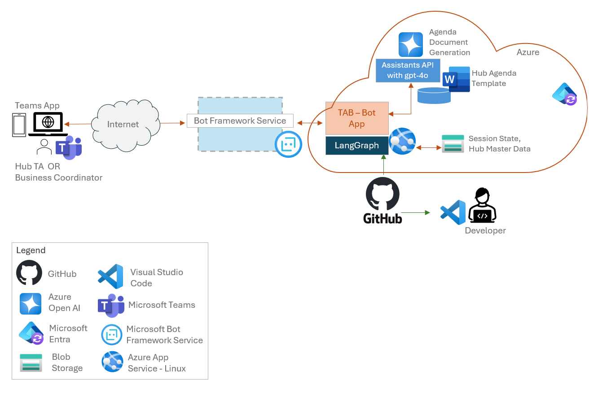

cat > readme.md << 'EOF'
# Technical Architect Buddy (TAB) for Innovation Hub

## Overview
TAB is an AI-powered assistant designed to help Technical Architects at Microsoft Innovation Hub prepare for customer engagements. It automates the process of extracting key information from meeting notes, creating structured agendas, and generating professional Microsoft Word documents for Innovation Hub sessions.

## Features
- **Meeting Notes Analysis**: Extracts metadata and agenda goals from internal and external meeting notes
- **Agenda Creation**: Generates detailed agendas based on extracted information and customer requirements
- **Document Generation**: Creates formatted Microsoft Word (.docx) documents ready for customer presentations
- **Speaker Matching**: Automatically assigns appropriate speakers from the Innovation Hub team based on topics

It is generic in its implementation, and can be used across Innovation Hub Locations, through configuration and adding minimal content to a Blob Store.

## System Architecture
The application uses an agentic AI approach with multiple specialized components:
- **Notes Extractor Agent**: Extracts and validates metadata and goals from meeting notes
- **Agenda Creator Agent**: Generates structured agendas based on extracted information
- **Document Generator Agent**: Creates and formats Word documents with the agenda
- **State Management**: Manages the workflow across different stages

## Prerequisites
- Python 3.12+
- Azure OpenAI Service
- Azure Blob Storage
- Azure Application Insights

## Setup Instructions
1. Clone the repository
2. Install dependencies: `pip install -r requirements.txt`
3. Copy [`.example-env`](.example-env ) to [`.env`](.env ) and configure with your Azure service details
4. Run the application: `python app.py`

## Workflow
1. Provide meeting notes (internal or external) to the system
2. The Notes Extractor Agent identifies metadata and goals
3. The Agenda Creator Agent generates a structured agenda
4. The Document Generator Agent creates a Word document
5. The final document is saved and can be shared with the customer

## Configuration
Key configuration parameters are set in [`config.py`](config.py ) and include:
- Azure OpenAI endpoints and API versions
- Storage account details
- Logging configuration
- Application settings

## Key Files
- [`app.py`](app.py ): Main application entry point
- [`graph_build.py`](graph_build.py ): Defines the workflow and agent interactions using LangGraph
- [`tools/agenda_selector.py`](tools/agenda_selector.py ): Handles agenda generation logic
- [`tools/doc_generator.py`](tools/doc_generator.py ): Creates Word documents
- [`input_files/Hub-Bengaluru.md`](input_files/Hub-Bengaluru.md ): Contains speaker and topic mappings
- [`bots/state_management_bot.py`](bots/state_management_bot.py ): Manages conversation state

## Design of the Multi Agent System

The design is based on LangGraph. See below

## Solution Architecture

## License
Copyright (c) Microsoft Corporation. All rights reserved.
EOF